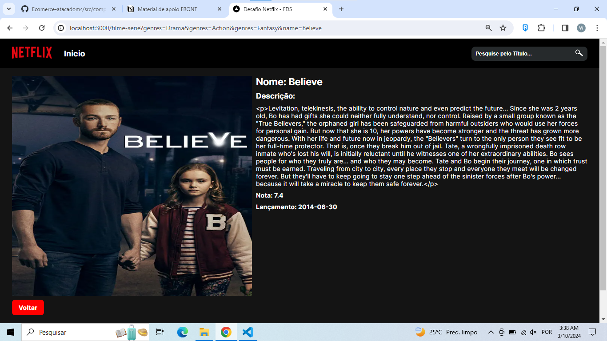

## Desafio do Processo Seletivo da Fábrica de Software 2024.1

- Desfaio proposto para criação de um webSite de filmes, consumindo dados da API https://www.tvmaze.com/api.
- Requisitos:
• Um header que contenha no mínimo a logo da Netflix e um link de "INÍCIO."
• Cada filme ou serie  deve mostrar o título, uma imagem do pôster e uma breve sinopse.
• Adicionar uma seção de destaque com carrossel, apresentando os fotos de filmes ou séries. (Pode usar bibliotecas como Swiper)
• Incluir informações adicionais, como avaliação e data de lançamento, nos cartões dos filmes.    
• Adicionar um campo de pesquisa para permitir que os usuários encontrem episódios específicos pelo título ou pelo nome do ator.
• Estilizar o layout 100% responsivo para todos os depositívos.

- Todos os requisitos foram concluidos com sucesso. O desafio foi proposto na sexta 08/03, com o prazo de entrega para o domingo 
10/03 às 12hrs, ou seja menos de 2 dias para  concluir o projeto, logo não pude elaborar algo mais sofisticado, apenas foquei em 
concluir os requisitos para entregar o projeto em tempo.

- Tecnolgias e ferramentas utilizadas:
 • JavaScript
 • TypeScript
 • React/Next.Js
 • Biblioteca Swiper
 • API: https://www.tvmaze.com/api.

## Funcionalidades

- Home, pagina inicial do WebSite: 
    

     
    

- Slides utilizando o Swiper, com Filmes e Séries divididas por Gênero:
    

     
    
 

-  Quando clicar no card de algum filme ou série, o usuário é direcionado para uma página com mais detalhes sobre a obra selecionada:
    

     
    
 
 
- Componente Search para pesquisa de algum título que possa estar no banco da API utilizada, pesquisas só pelo nome do Filme ou Série: 
    

     
    
 
     

     
    
 
- A aplicação se encontra com design responsivo para todos os dispositivos: 
    

     
    
 
     

     
    
 

## Deploy 

- Pretendo fazer o deploy na vercerl quando tiver mais tempo de implementar na aplicação mais funcionalidades do que deu para fazer, deixando mais sofisticada.
